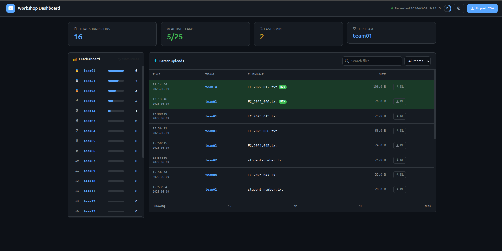

<p align="center">
  
</p>

<h1 align="center">Byte2Cloud — Workshop Dashboard</h1>

<p align="center">
  A real-time submission monitoring dashboard for the <strong>Byte2Cloud Linux Workshop</strong>.<br/>
  Instructors can watch live as teams upload their answers over SSH/SCP.
</p>

<p align="center">
  
</p>

---

## Overview

This repository contains everything needed to run the Byte2Cloud Linux workshop end-to-end:

1. **Workshop Setup** — creates 25 team accounts with mission files and submission directories.
2. **SSH Fix** — enables password-based SSH login for all team accounts.
3. **Submission Dashboard** — a live web dashboard to monitor team submissions in real time, available in two flavours:
   - **Python Standalone Server** — zero-dependency, works on any machine.
   - **Nginx + PHP Server** — production-grade setup for a dedicated Ubuntu server.

---

## Repository Structure

```
byte2cloud-scoreboard/
│
├── setup_byte2cloud.sh           ← Main workshop setup script (run first)
├── fix_ssh.sh                    ← Enables SSH password login for teams
│
├── images/                       ← Screenshots
│   └── UI.png                    ← Dashboard UI screenshot
│
├── python-server/                ← Standalone Python dashboard (no nginx needed)
│   ├── server.py                 ← Python HTTP server (serves UI + API)
│   ├── index.html                ← Dashboard frontend (HTML/CSS/JS)
│   ├── setup-service.sh          ← Installs server as a systemd background service
│   └── README.md                 ← Python server specific documentation
│
├── nginx-php-server/             ← Production Nginx + PHP dashboard
│   ├── index.html                ← Dashboard frontend (HTML/CSS/JS)
│   ├── submissions.php           ← JSON API: scans all team submission folders
│   ├── download.php              ← Secure file download endpoint
│   ├── nginx-workshop.conf       ← Nginx virtual host configuration
│   ├── install.sh                ← Full automated installation script for Ubuntu
│   ├── workshop-dashboard.tar.gz ← Pre-packaged archive of web files
│   └── README.md                 ← Nginx/PHP server specific documentation
│
└── logos/
    ├── Byte2Cloud.png
    └── byte2cloud_main.png
```

---

## Step 1 — Workshop Server Setup

Run this **once** on the server as root to create all 25 team accounts, mission files, and submission directories.

```bash
sudo bash setup_byte2cloud.sh
```

### What this script does

| Step | Action |
|---|---|
| 1 | Creates a `missionfiles` Linux group |
| 2 | Creates 25 team accounts (`team01`–`team25`) with password `Byte2Cloud@2026` |
| 3 | Encodes a secret message in base64 and splits it into 4 fragments |
| 4 | Creates the mission directory tree under `/opt/mission/` |
| 5 | Writes the 4 fragments and a `README.txt` briefing for students |
| 6 | Sets permissions so teams can read fragments but not modify them |
| 7 | Creates per-team submission folders at `/opt/submissions/teamXX/` with `~/submissions` symlinks |
| 8 | Writes a scoped `sudoers` rule so teams can only `sudo cat` fragment 4 |
| 9 | Runs verification checks and prints a summary |

### Server directory layout after setup

```
/opt/mission/
├── README.txt                          ← Mission brief for students
├── archives/2024/logs/
│   └── fragment_1.frag                 ← Visible fragment (chmod 444)
└── hidden/
    └── .fragment_2.frag                ← Hidden fragment (chmod 444)

/var/mission/secrets/
├── .fragment_3.frag                    ← Hidden fragment (chmod 444)
└── .fragment_4.frag                    ← Root-only fragment (chmod 700, needs sudo)

/opt/submissions/
├── team01/                             ← Team's private upload folder (chmod 700)
├── team02/
└── … team25/

/home/teamXX/
└── submissions → /opt/submissions/teamXX/   ← Symlink for easy SCP
```

---

## Step 2 — Enable SSH Password Login (if needed)

If teams cannot log in with their password, run:

```bash
sudo bash fix_ssh.sh
```

This safely edits `/etc/ssh/sshd_config` to enable `PasswordAuthentication yes` scoped to `team*` accounts only, then restarts the SSH service. A backup of the original config is created automatically.

---

## Step 3 — Run the Submission Dashboard

Choose **one** of the two server options below.

---

### Option A: Python Standalone Server *(Recommended — no dependencies)*

**Use this when:** you want to run the dashboard on any machine (Linux/Mac) without installing Nginx or PHP.

```bash
cd python-server/
python3 server.py
```

Access from another computer:
```
http://<server-ip>:8080
```

**To run as a permanent background service (auto-starts on boot):**
```bash
sudo bash python-server/setup-service.sh
```

| Command | Action |
|---|---|
| `sudo systemctl status workshop-dashboard` | Check if service is running |
| `sudo systemctl stop workshop-dashboard` | Stop the service |
| `sudo systemctl restart workshop-dashboard` | Restart the service |
| `sudo journalctl -u workshop-dashboard -f` | View live logs |

> See [`python-server/README.md`](python-server/README.md) for full configuration options.

---

### Option B: Nginx + PHP Server *(Production)*

**Use this when:** you are deploying on a dedicated Ubuntu 24.04 server (e.g., DigitalOcean droplet).

```bash
sudo bash nginx-php-server/install.sh
```

This installs Nginx, PHP-FPM, deploys all web files to `/var/www/workshop/`, sets up bind-mounts so the web server can read submission folders, configures the firewall, and starts all services.

Access the dashboard at:
```
http://<server-ip>
```

> See [`nginx-php-server/README.md`](nginx-php-server/README.md) for full details.

---

## Dashboard Features

| Feature | Detail |
|---|---|
| **Auto-refresh** | Fetches new data every 5 seconds via AJAX — no page reload |
| **Submission counter** | Live total count across all 25 teams |
| **Active teams** | Shows how many teams have submitted at least one file |
| **Recent uploads** | Highlights files uploaded in the last 5 minutes |
| **Leaderboard** | Teams ranked by submission count with animated progress bars |
| **Search & Filter** | Filter the file table by team or search by filename |
| **Secure download** | Download any submission file directly from the dashboard UI |
| **CSV export** | Export all submission data to a `.csv` file |
| **Light / Dark mode** | Toggle between dark (default) and light themes |
| **Countdown ring** | Visual countdown timer showing seconds until next refresh |

---

## Workshop Mission — How It Works

Students SSH into the server and follow the `README.txt` mission brief:

1. **Find 4 base64 fragments** hidden across the server filesystem using Linux commands (`ls -la`, `find`, `sudo cat`).
2. **SCP fragments to their local machine** using secure copy.
3. **Combine and decode** the fragments: `cat frag1 frag2 frag3 frag4 | base64 -d > message.txt`
4. **Extract the secret code word** from the decoded message.
5. **Submit their answer** by SCP-ing a text file into `~/submissions/`.

```
# SSH into the server
ssh team01@<server-ip>
# password: Byte2Cloud@2026

# Read the mission brief
cat /opt/mission/README.txt
```

---

## Quick Reference

| Task | Command |
|---|---|
| Set up workshop (run once) | `sudo bash setup_byte2cloud.sh` |
| Fix SSH password login | `sudo bash fix_ssh.sh` |
| Start Python dashboard | `python3 python-server/server.py` |
| Install Python dashboard as service | `sudo bash python-server/setup-service.sh` |
| Install Nginx/PHP dashboard | `sudo bash nginx-php-server/install.sh` |
| Connect as a team | `ssh team01@<server-ip>` (password: `Byte2Cloud@2026`) |
| Submit answer | `scp answer.txt team01@<server-ip>:~/submissions/` |
